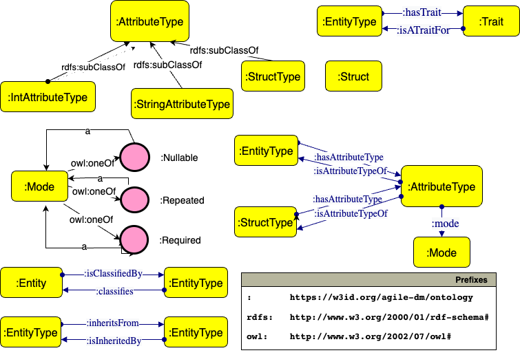

# Concepts

The central concept is the "user-defined type". A name, a list of traits, and a schema define a user-defined type.

Another important concept is "trait". A trait is a tag marking that a specific type implements a particular behavior. A trait optionally inherits from a single trait.

A "user-defined type" can be marked by multiple traits, and it optionally inherits from another user-defined type.

All those concepts are defined in the first and second levels of the ontology, which are loaded at initialization time.

The picture above shows the machinery defined in the first level of the ontology for defining "user-defined" types.

This paper, Dynamic_Creation_of_Data_Platform_Assets.pdf, under the papers project folder, provides a deeper description of the ontology with the different levels.

Another concept is the "trait relationship". Predefined relationships can link the traits. Currently, the system provides a "hasPart" relationship for modeling the composition relationship.

Once a specific relationship links two traits, the exact relationship can be used for linking the user-defined type instances where the two types are linked to those traits. This mechanism allows the separation of the structural details from the schema details of a user-defined type.

Traits can be defined and linked to each other dynamically. Traits and their relationships are put in the second layer of the ontology (L1), as explained in the referenced paper.

All the user-defined types are then created in the third layer of the ontology (L2).

The following important concept is "entity". An entity is an instance of a user-defined type (EntityType in the ontology). An entity can be created by defining its type with a value tuple conformed to the schema.

All the entities are defined inside the fourth level of the ontology (L3).

The presentation, Ontology-Based-Generation-of-Data-Platform-Assets.pdf, under the papers project folder, provides some examples that should better clarify all these concepts.
