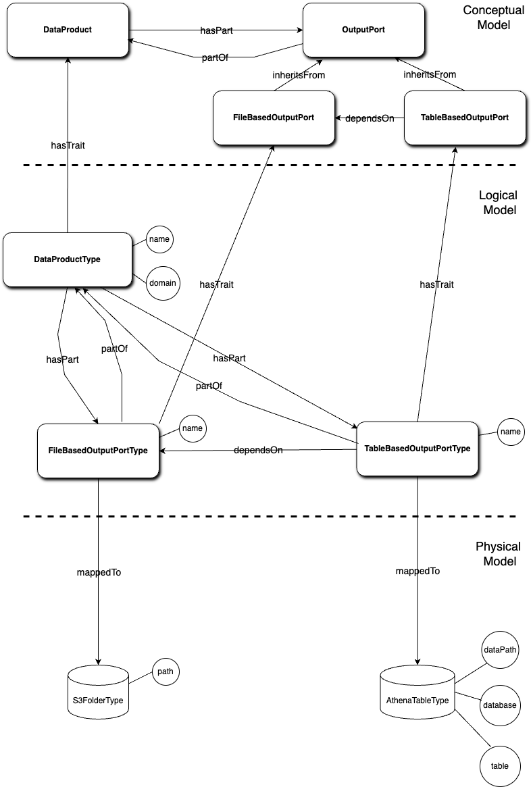

# Simple Data Mesh Example

## Structure of the example
The diagram of a simple data mesh is shown below:



### Conceptual Layer
* **DataProduct**: represents a high-level data product. It has a relationship indicating that it has as a part (*hasPart*) an **OutputPort**;
* **OutputPort**: represents the output interface of the data product, it is *partOf* the **DataProduct**;
* **FileBasedOutputPort**: it's a type of output port dealing with file-based data, it *inheritsFrom* the **OutputPort**;
* **TableBasedOutputPort**: it's a type of output port dealing with table-based data, it *dependsOn* the **FileBasedOutputPort**.

The elements previously described are all Traits.

### Logical Layer
* **DataProductType**: represents different types of data products, it has as a trait (*hasTrait*) the **DataProduct**;
* **FileBasedOutputPortType**: a generic type of file-based output port, it is *partOf* a **DataProductType**;
* **TableBasedOutputPortType**: a generic type of table-based output port, it is *partOf* a **DataProductType**. This output port also *dependsOn* the other output port: **FileBasedOutputPortType**.

The elements previously described are all EntityTypes.

### Physical Layer
* **S3FolderType**: represents a type of storage used in file-based output ports. It maps to the **FileBasedOutputPortType** and has an attribute path;
* **AthenaTableType**: Represents a type of storage used in table-based output ports. It maps to the **TableBasedOutputPortType** and has attributes like dataPath, database, and table.

These elements are also all EntityTypes.

### EntityType Attributes
Both EntityTypes **S3Folder** and **AthenaTable** have attributes that are mapped from attributes which are located in other EntityTypes.<br>
Specifically, the path attribute of the **S3Folder** is created by writing "domain.name" where domain and name are attributes of **DataProductType**.
This will be achieved by using the mapping as shown in [Creating the mappings](#creating-the-mappings).

## Building the Data Mesh
To create the date mesh you can run the following curls in the specified order or run the bash script as shown in [Creating everything in one go](#creating-everything-in-one-go).
### Creating the Traits and Relationships
In this folder there are the YAML files for creating all the entities needed for the example. We begin by creating the needed Traits and Relationships, we do this by using the following curl:

```bash
curl -X 'POST' \
  'http://127.0.0.1:8093/dataplatform.shaper.uservice/0.0/ontology/trait/bulk/yaml' \
  -H 'accept: application/json' \
  -H 'Content-Type: application/octet-stream' \
  --data-binary '@traitsAndRelationships.yaml'
```  
Basically the whole [conceptual layer](#conceptual-layer) was created through one curl, which used the contents of the file “traitsAndRelationships.yaml”.

### Creating the EntityTypes
We now proceed with the creation of the necessary EntityTypes, to do this we run the following curls, to create **DataProductType**:

```bash
curl -X 'POST' \
  'http://127.0.0.1:8093/dataplatform.shaper.uservice/0.0/ontology/entity-type/yaml' \
  -H 'accept: application/text' \
  -H 'Content-Type: application/octet-stream' \
  --data-binary '@DataProductType.yaml'
```
To create **FileBasedOutputPortType**:

```bash
curl -X 'POST' \
  'http://127.0.0.1:8093/dataplatform.shaper.uservice/0.0/ontology/entity-type/yaml' \
  -H 'accept: application/text' \
  -H 'Content-Type: application/octet-stream' \
  --data-binary '@FileBasedOutputPortType.yaml'
```
To create **TableBasedOutputPortType**:

```bash
curl -X 'POST' \
  'http://127.0.0.1:8093/dataplatform.shaper.uservice/0.0/ontology/entity-type/yaml' \
  -H 'accept: application/text' \
  -H 'Content-Type: application/octet-stream' \
  --data-binary '@TableBasedOutputPortType.yaml'
```
To create **S3FolderType**:

```bash
curl -X 'POST' \
  'http://127.0.0.1:8093/dataplatform.shaper.uservice/0.0/ontology/entity-type/yaml' \
  -H 'accept: application/text' \
  -H 'Content-Type: application/octet-stream' \
  --data-binary '@S3FolderType.yaml'
```
And finally to create **AthenaTableType**:

```bash
curl -X 'POST' \
  'http://127.0.0.1:8093/dataplatform.shaper.uservice/0.0/ontology/entity-type/yaml' \
  -H 'accept: application/text' \
  -H 'Content-Type: application/octet-stream' \
  --data-binary '@AthenaTableType.yaml'
```

### Creating the mappings
As we can see from [Structure of the example](#structure-of-the-example), there are two mappings in the example: these mappings aim to create the attributes of **S3FolderType** and **AthenaTableType** as a function of some attributes present in other EntityTypes. As we can see from "TableBasedMapping.yaml" we can specify an additional reference using a path that allows me to get to the EntityType that contains the attribute I need, for example S3FolderType can be reached from AthenaTableType using:
```
source/dependsOn/FileBasedOutputPortType/mappedTo/S3FolderType
```
To create the mapping between **FileBasedOutputPortType** and **S3FolderType** we use:

```bash
curl -X 'POST' \
  'http://127.0.0.1:8093/dataplatform.shaper.uservice/0.0/ontology/mapping/yaml' \
  -H 'accept: application/text' \
  -H 'Content-Type: application/octet-stream' \
  --data-binary '@TableBasedMapping.yaml'
```
And to create the mapping between **TableBasedOutputPortType** and **AthenaTableType** we use:

```bash
curl -X 'POST' \
  'http://127.0.0.1:8093/dataplatform.shaper.uservice/0.0/ontology/mapping/yaml' \
  -H 'accept: application/text' \
  -H 'Content-Type: application/octet-stream' \
  --data-binary '@FileBasedMapping.yaml'
```

### Creating the Entities
Now that the example structure has been created, we can try to create example Entities for the EntityTypes. We start by creating an Entity for the **DataProductType**:

```bash
curl -s -X 'POST' \
  'http://127.0.0.1:8093/dataplatform.shaper.uservice/0.0/ontology/entity/yaml' \
  -H 'accept: application/text' \
  -H 'Content-Type: application/octet-stream' \
  --data-binary '@DataProduct.yaml'
```
If the creation was successful, the response should be the id related to the Entity created, in my example the id is: ```32562311-6e67-44be-879e-a93529c5232d```<br>
We continue by creating an Entity for the **FileBasedOutputPortType**:

```bash
curl -s -X 'POST' \
  'http://127.0.0.1:8093/dataplatform.shaper.uservice/0.0/ontology/entity/yaml' \
  -H 'accept: application/text' \
  -H 'Content-Type: application/octet-stream' \
  --data-binary '@FileBasedOutputPort.yaml'
```
Which returned: ```d1a78a13-ad50-4bf6-9d68-ffe2113dbcc4```<br>
Now by using the returned ids we call the following curl to link the instances with relationship *hasPart*:

```bash
curl -X 'POST' \
  'http://127.0.0.1:8093/dataplatform.shaper.uservice/0.0/ontology/entity/link/32562311-6e67-44be-879e-a93529c5232d/hasPart/d1a78a13-ad50-4bf6-9d68-ffe2113dbcc4' \
  -H 'accept: application/text' \
  -d ''
```
For the last Entity created, we create one for **TableBasedOutputPortType** as well:

```bash
curl -X 'POST' \
  'http://127.0.0.1:8093/dataplatform.shaper.uservice/0.0/ontology/entity/yaml' \
  -H 'accept: application/text' \
  -H 'Content-Type: application/octet-stream' \
  --data-binary '@TableBasedOutputPort.yaml'
```
Which returned ```772bb3a1-a812-4452-8be6-55deb60d9d4c``` in my case.
Now that all the Entities for the EntityTypes have been created, we link the remaining ones by using:

```bash
curl -X 'POST' \
  "http://127.0.0.1:8093/dataplatform.shaper.uservice/0.0/ontology/entity/link/772bb3a1-a812-4452-8be6-55deb60d9d4c/dependsOn/d1a78a13-ad50-4bf6-9d68-ffe2113dbcc4" \
  -H 'accept: application/text' \
  -d ''
```
Which is going to link the TableBased entity with the FileBased entity with relationship *dependsOn*, and we are also going to run:

```bash
curl -X 'POST' \
  "http://127.0.0.1:8093/dataplatform.shaper.uservice/0.0/ontology/entity/link/32562311-6e67-44be-879e-a93529c5232d/hasPart/772bb3a1-a812-4452-8be6-55deb60d9d4c" \
  -H 'accept: application/text' \
  -d ''
```
In order to link the DataProduct entity with the TableBased entity with relationship *hasPart*.

### Creating the mapped instances
Last but not least, we are going to create the mapped Entities, we start with the Entity for **S3FolderType** by using:

```bash
curl -X 'POST' \
  'http://127.0.0.1:8093/dataplatform.shaper.uservice/0.0/ontology/mapping/mappedInstances' \
  -H 'accept: application/text' \
  -H 'Content-Type: application/text' \
  -d 'd1a78a13-ad50-4bf6-9d68-ffe2113dbcc4'
```
And finally we create the Entity for **AthenaTableType** via:

```bash
curl -X 'POST' \
  'http://127.0.0.1:8093/dataplatform.shaper.uservice/0.0/ontology/mapping/mappedInstances' \
  -H 'accept: application/text' \
  -H 'Content-Type: application/text' \
  -d '772bb3a1-a812-4452-8be6-55deb60d9d4c'
```
These last two curls complete the example by creating the Entities of the [physical layer](#physical-layer).

### Creating everything in one go
Should you want to create the entire example, the folder contains a bash script called setup.sh that performa all the curls shown above.
